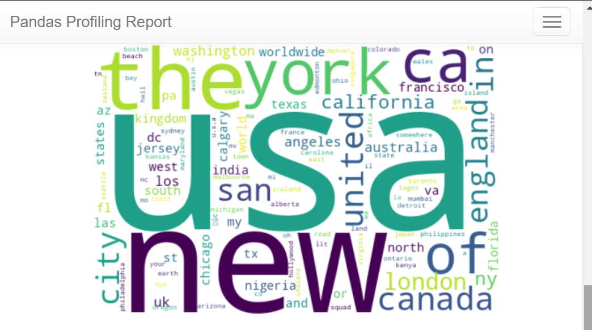

# Disaster Tweets Classification

This project classifies tweets as **real disaster tweets** or **non-disaster tweets** using Natural Language Processing (NLP) techniques. It is based on the dataset from Kaggle's **"Real or Not? NLP with Disaster Tweets"** competition.

---

## Table of Contents

- [Overview](#overview)
- [Dataset](#dataset)
- [Installation](#installation)
- [Code Walkthrough](#code-walkthrough)
- [Acknowledgments](#acknowledgments)

---

## Overview

The goal of this project is to classify tweets into two categories:
- **Disaster Tweets (target = 1)**: Tweets related to real disasters.
- **Non-Disaster Tweets (target = 0)**: Tweets unrelated to disasters.

### Key Highlights:
- **Exploratory Data Analysis (EDA)**: Performed using `ydata-profiling` for comprehensive insights.
- **Preprocessing**: Text cleaning, tokenization, removing stopwords, and lemmatization.
- **Modeling**: Used an LSTM (Long Short-Term Memory) model for classification.
- **Evaluation**: Achieved **98% accuracy** on the validation dataset.

---

## Dataset

The dataset is sourced from Kaggle's competition: **[Real or Not? NLP with Disaster Tweets](https://www.kaggle.com/competitions/nlp-getting-started)**.

### Files:
- **Train Dataset**: `/kaggle/input/nlp-getting-started/train.csv`
- **Test Dataset**: `/kaggle/input/nlp-getting-started/test.csv`

### Features:
1. `id`: Unique identifier for each tweet.
2. `keyword`: A keyword from the tweet (if available).
3. `location`: The location the tweet was sent from (if available).
4. `text`: The actual tweet content.
5. `target`: Target variable (1 if the tweet is about a real disaster, 0 otherwise — only in the training set).

---

## Installation

### Prerequisites

- Python 3.10+
- Jupyter Notebook
- Kaggle API for downloading datasets (if required).

  ---
  ## Code Walkthrough

-**Import Libraries**:
Imports essential libraries like pandas and numpy for data manipulation.
Loads the dataset into df_train and df_test.

-**Exploratory Data Analysis (EDA)**:
Utilizes the ydata-profiling package for generating an in-depth analysis report of the dataset.
Outputs HTML-based profiling of the training data.

-**Data Inspection**:
Quickly inspects the head of the training and test datasets using print(df_train.head()) and print(df_test.head()).

-**Profile Report**:
Generates a detailed HTML report for the training dataset using df_train.profile_report().

---
## Acknowledgments

Kaggle for the dataset: Real or Not? NLP with Disaster Tweets.
YData for the ydata-profiling package used for EDA.
Open-source contributors for libraries like pandas, numpy, and ydata-profiling.
